<head>
<link rel="stylesheet" href="https://cdnjs.cloudflare.com/ajax/libs/font-awesome/4.7.0/css/font-awesome.min.css">
<link rel="stylesheet" href="local.css">
</head>

# I. Deep Generative Modeling 

 

	

		<h3>SQ-VAE</h3>
		
		<h5>
			<a href="https://proceedings.mlr.press/v162/takida22a.html">[PMLR]</a>
			<a href="https://arxiv.org/abs/2205.07547">[arXiv]</a>
			<a href="https://github.com/sony/sqvae">[code]</a>
		</h5>
		
SQ-VAE: Variational Bayes on Discrete Representation with Self-annealed Stochastic Quantization (ICML2022)

	

	

		<h3>FP-Diff</h3>
		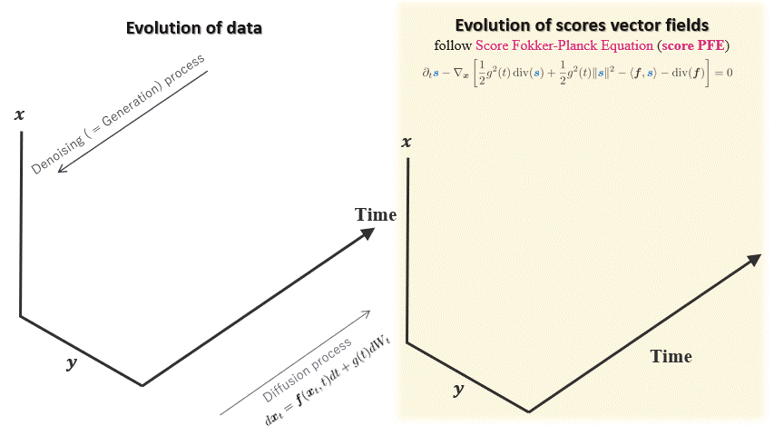
		<h5>
			<a href="https://arxiv.org/abs/2210.04296">[arXiv]</a>
		</h5>
		
Regularizing Score-based Models with Score Fokker-Planck Equations (NeurIPS2022 Workshop on Score-Based Methods)

	

	

		<h3>Adaptive DDRM</h3>
		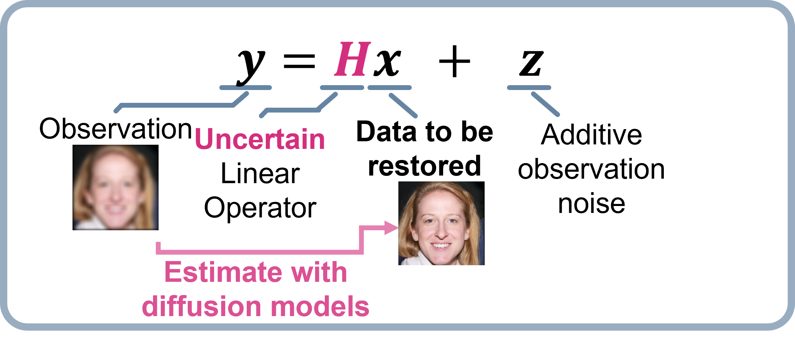
		<h5>
			<a href="X">[code]</a>
			<a href="X">[arXiv]</a>
		</h5>
		
 X 

	
		

# II. Music Technologies

 

	

		<h3>Sound Separation</h3>
		<a href="https://ieeexplore.ieee.org/document/9746317">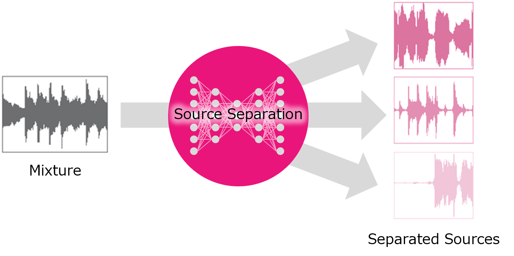</a>
		<h5>
			<a href="https://ieeexplore.ieee.org/document/9746317">[IEEE]</a>
		</h5>
		
Music Source Separation with Deep Equilibrium Models (ICASSP22)

	

	

		<h3>Sound Separation</h3>
		
		<h5>
			<a href="https://www.youtube.com/watch?v=EWYxJGmw0Ng">[video]</a>
			<a href="https://www.sony.com/en/SonyInfo/technology/stories/AI_Sound_Separation/">[site]</a>
		</h5>
		
Glenn Gould and Kanji Ishimaru 2021: A collaboration with AI Sound Separation after 60 years

	

	

		<h3>MDX21</h3>
		<a href="https://mdx-workshop.github.io/">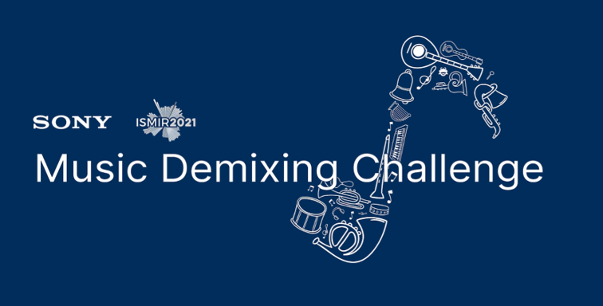</a>
		<h5>
			<a href="https://mdx-workshop.github.io/">[site]</a>
			<a href="https://www.frontiersin.org/articles/10.3389/frsip.2021.808395/full">[frontiers]</a>
		</h5>
		
Music Demixing Challenge 2021

	
		

	

		<h3>Singing Voice Vocoder</h3>
		<a href="X">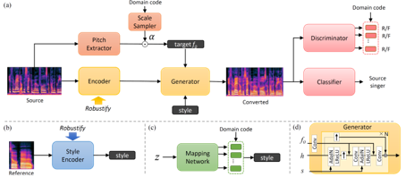</a>
		<h5>
			<a href="https://arxiv.org/abs/2210.07508">[arXiv]</a>
			<a href="https://t-naoya.github.io/hdm/">[demo]</a>
		</h5>
		
Hierarchical Diffusion Models for Singing Voice Neural Vocoder

	

	

		<h3>Singing Voice Conversion</h3>
		<a href="X">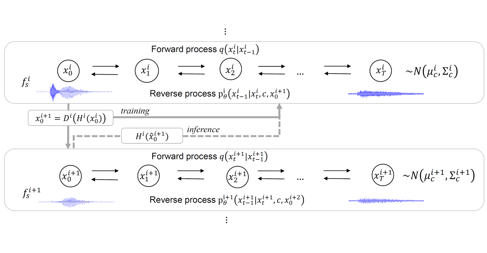</a>
		<h5>
			<a href="https://arxiv.org/abs/2210.11096">[arXiv]</a>
			<a href="https://t-naoya.github.io/rosvc/">[demo]</a>
		</h5>
		
Robust One-Shot Singing Voice Conversion

	

	

		<h3>Vocal Dereverberation</h3>
		<a href="X">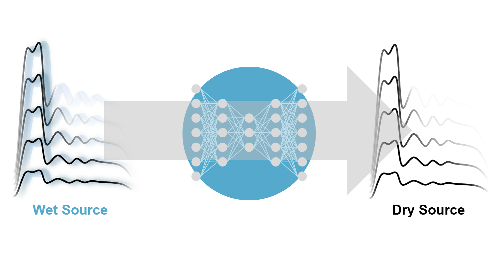</a>
		<h5>
			<a href="https://arxiv.org/abs/2211.04124">[arXiv]</a>
			<a href="https://koichi-saito-sony.github.io/unsupervised-vocal-dereverb/">[demo]</a>
		</h5>
		
Unsupervised Vocal Dereverberation with Diffusion-based Generative Models

	
		

	

		<h3>Distortion Effect Removal</h3>
		<a href="X">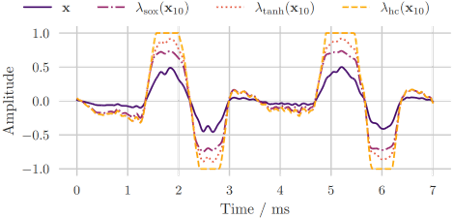</a>
		<h5>
			<a href="https://ismir2022program.ismir.net/poster_113.html">[poster]</a>
			<a href="https://arxiv.org/abs/2202.01664">[arXiv]</a>
			<a href="https://joimort.github.io/distortionremoval/">[demo]</a>
		</h5>
		
Distortion Audio Effects: Learning How to Recover the Clean Signal (ISMIR22)

	

	

		<h3>Music Transcription</h3>
		<a href="X">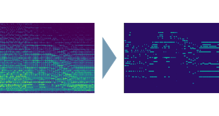</a>
		<h5>
			<a href="https://arxiv.org/abs/2210.05148">[arXiv]</a>
			<a href="https://github.com/sony/DiffRoll">[code]</a>
			<a href="https://sony.github.io/DiffRoll/">[demo]</a>
		</h5>
		
DiffRoll: Diffusion-based Generative Music Transcription with Unsupervised Pretraining Capability

	

	

		<h3>Automatic Music Mixing</h3>
		<a href="X">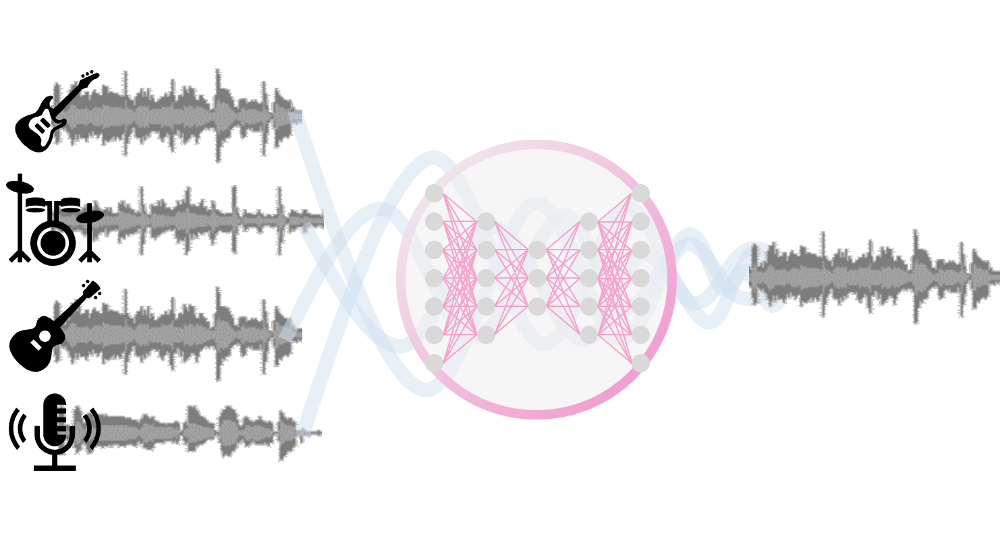</a>
		<h5>
			<a href="https://ismir2022program.ismir.net/poster_11.html">[poster]</a>
			<a href="https://arxiv.org/abs/2208.11428">[arXiv]</a>			
			<a href="https://github.com/sony/fxnorm-automix">[code]</a>
			<a href="https://marco-martinez-sony.github.io/FxNorm-automix/">[demo]</a>
		</h5>
		
Automatic Music Mixing with Deep Learning and Out-of-Domain Data (ISMIR22)

	
		

	

		<h3>Mixing Style Transfer</h3>
		<a href="X">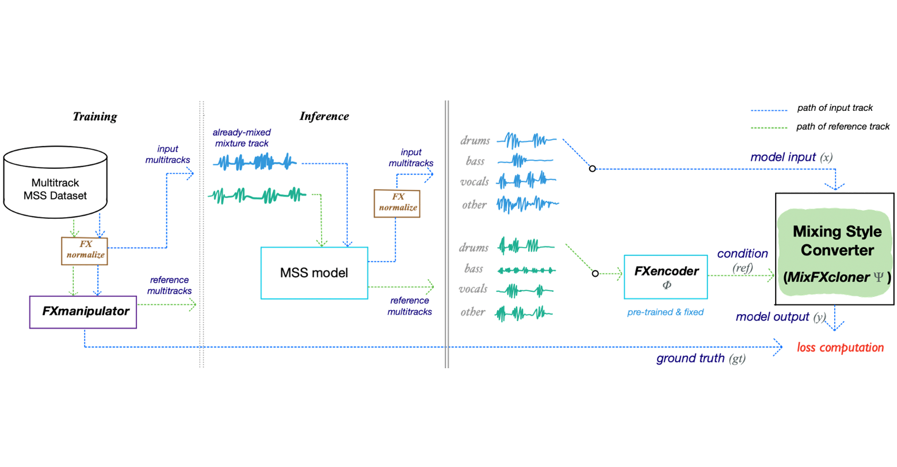</a>
		<h5>
			<a href="https://arxiv.org/abs/2211.02247">[arXiv]</a>
			<a href="https://github.com/jhtonyKoo/music_mixing_style_transfer">[code]</a>
			<a href="https://jhtonykoo.github.io/MixingStyleTransfer/">[demo]</a>
		</h5>
		
Music Mixing Style Transfer: A Contrastive Learning Approach to Disentangle Audio Effects

	

	

		<h3>Automatic DJ Transition</h3>
		<a href="X">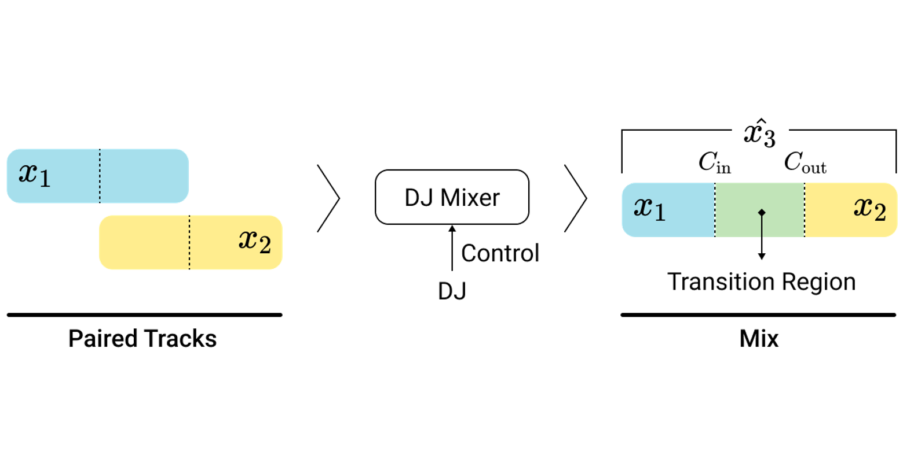</a>
		<h5>
			<a href="https://arxiv.org/abs/2110.06525">[arXiv]</a>
			<a href="https://github.com/ChenPaulYu/DJtransGAN">[code]</a>
			<a href="https://paulyuchen.com/djtransgan-icassp2022/">[demo]</a>
		</h5>
		
Automatic DJ Transitions with Differentiable Audio Effects and Generative Adversarial Networks (ICASSP22)

	

	

