<head>
<link rel="stylesheet" href="https://cdnjs.cloudflare.com/ajax/libs/font-awesome/4.7.0/css/font-awesome.min.css">
<link rel="stylesheet" href="local.css">
</head>

	
<a href="#sec_dgm">Deep Generative Modeling</a>

	
<a href="#sec_nlp">Multimodal NLP</a>

	
<a href="#sec_mt">Music Technology</a>

	
<a href="#sec_ct">Cinematic Technology</a>

	
<a href="#sec_challenges">Hosted Challenges</a>

# Deep Generative Modeling

 

	

		<h3>CMT</h3>
		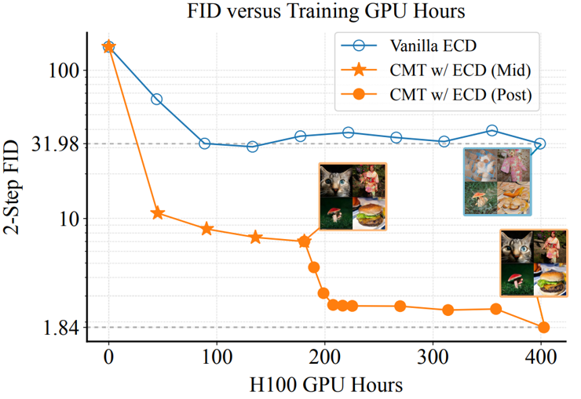
		<h5>
			<a href="https://www.arxiv.org/abs/2509.24526">[arXiv]</a>
		</h5>
		
CMT reduces the training cost of diffusion-based flow map models by up to 90% while reaching SOTA performance

		
ICLR26

	

	

		<h3>ConceptTRAK</h3>
		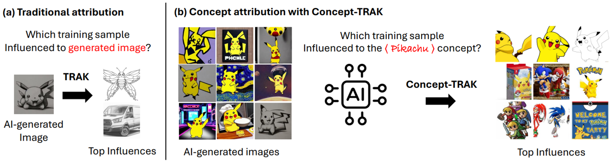
		<h5>
			<a href="https://www.arxiv.org/abs/2507.06547">[arXiv]</a>
		</h5>
		
A framework for Identify which training examples influenced specific concepts within the diffusion model

		
ICLR26

	

	

		<h3>CODA</h3>
		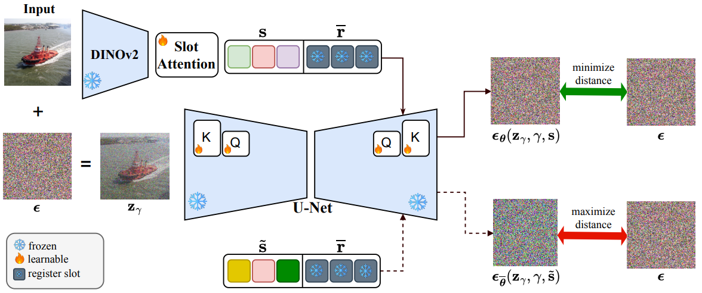
		<h5>
			<a href="https://www.arxiv.org/abs/2601.01224">[arXiv]</a>
		</h5>
		
Improved object-centric diffusion learning with registers and contrastive alignment

		
ICLR26

	

	

		<h3>Improved CFG</h3>
		
		<h5>
			<a href="https://www.arxiv.org/abs/2507.08965">[arXiv]</a>
		</h5>
		
An improved mechanism for applying classifier-free guidance in discrete diffusion

		
ICLR26

	

	

		<h3>SONA</h3>
		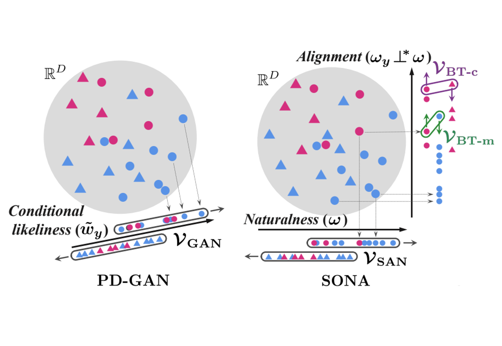
		<h5>
			<a href="https://www.arxiv.org/abs/2510.04576">[arXiv]</a>
		</h5>
		
Learning conditional, unconditional, and matching-aware discriminator with adaptive weighting mechanism (cSAN)

		
ICLR26

	

	

		<h3>TLoRA</h3>
		
		<h5>
			<a href="https://arxiv.org/abs/2501.08727">[arXiv]</a>
		</h5>
		
Propose tensor-decomposition-based PEFT method, showing its effectiveness on T-to-I generation tasks

		
ICCV25

	

	

		<h3>Di4C</h3>
		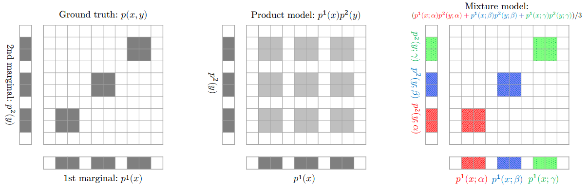
		<h5>
			<a href="https://arxiv.org/abs/2410.08709">[arXiv]</a>
			<a href="https://github.com/sony/di4c">[code]</a>
		</h5>
		
Theoretical analysis of limitation of current discrete diffusion and a method for effectively capturing element-wise dependency

		
ICML25

	

	

		<h3>VCT</h3>
		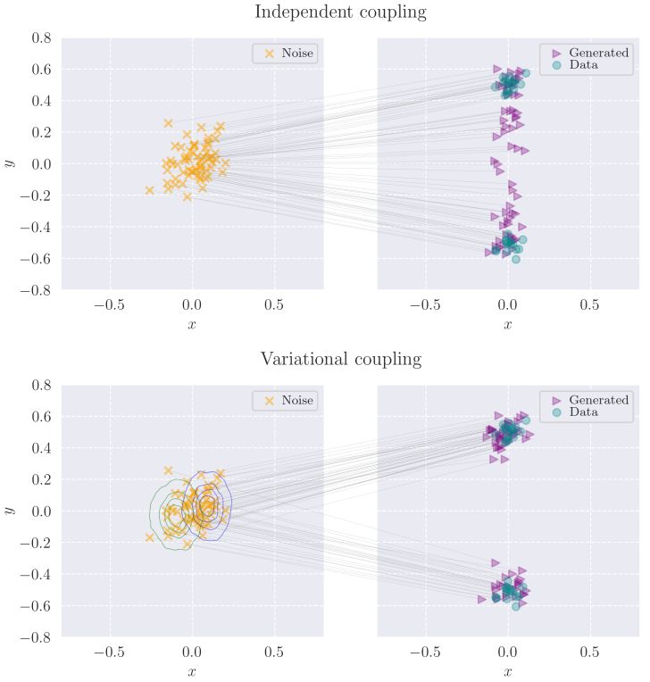
		<h5>
			<a href="https://arxiv.org/abs/2502.18197">[arXiv]</a>
			<a href="https://github.com/sony/vct">[code]</a>
		</h5>
		
Improving Consistency Training with a learned data-noise coupling

		
ICML25

	

	

		<h3>Memorization</h3>
		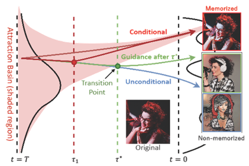
		<h5>
			<a href="https://arxiv.org/abs/2411.16738">[arXiv]</a>
			<a href="https://github.com/SonyResearch/mitigating_memorization">[code]</a>
		</h5>
		
Classifier-Free Guidance inside the Attraction Basin May Cause Memorization

		
CVPR25

	

	

		<h3>Jump Your Steps</h3>
		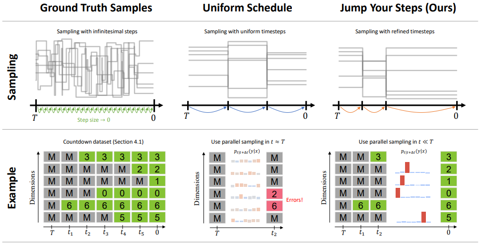
		<h5>
			<a href="https://arxiv.org/abs/2410.07761">[arXiv]</a>
		</h5>
		
A general method to find an optimal sampling schedule for inference in discrete diffusion

		
ICLR25

	

	

		<h3>HERO-DM</h3>
		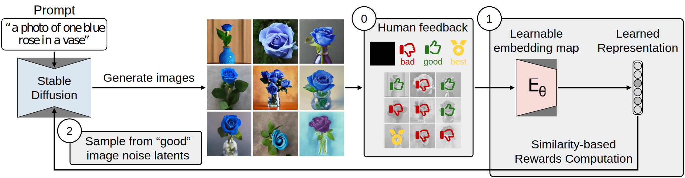
		<h5>
			<a href="https://arxiv.org/abs/2410.05116">[arXiv]</a>
			<a href="https://hero-dm.github.io/">[demo]</a>
		</h5>
		
A method efficiently leverages online human feedback to fine-tune Stable Diffusion for various range of tasks

		
ICLR25

	

	

		<h3>WPSE</h3>
		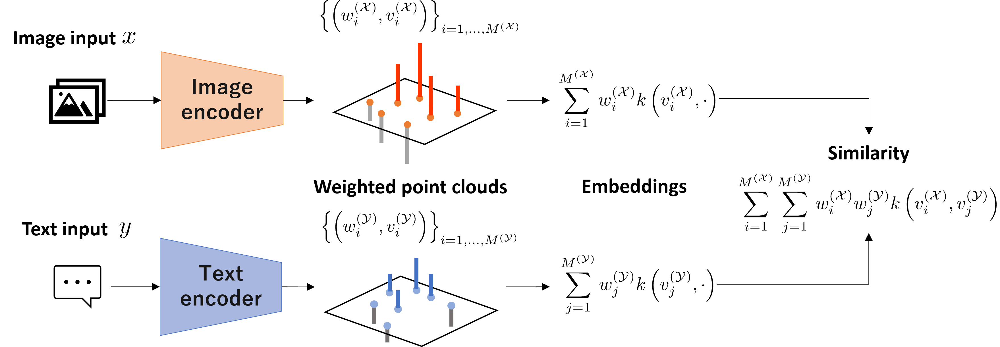
		<h5>
			<a href="https://arxiv.org/abs/2404.19228">[arXiv]</a>
		</h5>
		
An enhanced multimodal representation using weighted point clouds and its theoretical benefits

		
ICLR25

	

	

		<h3>PaGoDA</h3>
		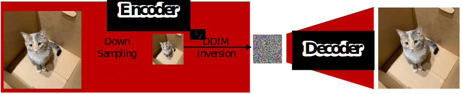
		<h5>
			<a href="https://arxiv.org/abs/2405.14822">[arXiv]</a>
		</h5>
		
A 64x64 pre-trained diffusion model is all you need for 1-step high-resolution SOTA generation

		
NeurIPS24

	
	
	

		<h3>CTM</h3>
		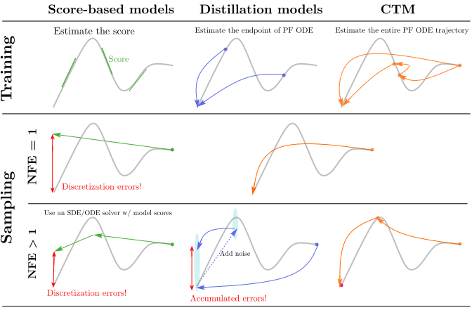
		<h5>
			<a href="https://arxiv.org/abs/2310.02279">[arXiv]</a>
			<a href="https://consistencytrajectorymodel.github.io/CTM/">[demo]</a>
		</h5>
		
Unified framework enables diverse samplers and 1-step generation SOTAs

		
ICLR24

		
Applications: 
			<a href="https://arxiv.org/abs/2405.18503">[SoundGen]</a>
		

	

	

		<h3>SAN</h3>
		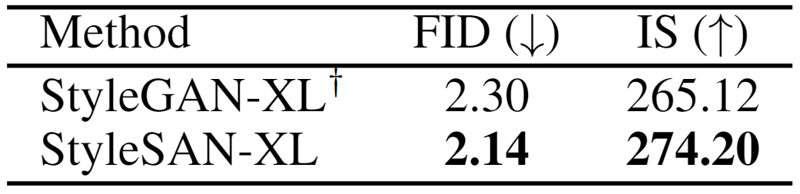
		<h5>
			<a href="https://arxiv.org/abs/2301.12811">[arXiv]</a>
			<a href="https://github.com/sony/san">[code]</a>
			<a href="https://ytakida.github.io/san/">[demo]</a>
		</h5>
		
Enhancing GAN with metrizable discriminators

		
ICLR24

		
Applications: 
			<a href="https://arxiv.org/abs/2309.02836">[Vocoder]</a>
		

	

	

		<h3>MPGD</h3>
		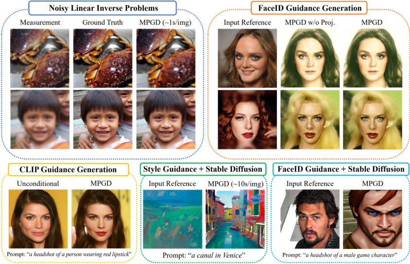
		<h5>
			<a href="https://arxiv.org/abs/2311.16424">[arXiv]</a>
			<a href="https://kellyyutonghe.github.io/mpgd/">[demo]</a>
		</h5>
		
Fast, Efficient, Training-Free, and Controllable diffusion-based generation method

		
ICLR24

	
	
	

		<h3>HQ-VAE</h3>
		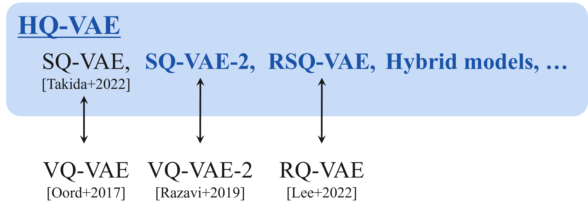
		<h5>
			<a href="https://openreview.net/forum?id=xqAVkqrLjx">[OpenReview]</a>
			<a href="https://arxiv.org/abs/2401.00365">[arXiv]</a>
		</h5>
		
Generalizing hierarchical VQ-VAEs with a Bayesian framework

		
TMLR

	

	

		<h3>FP-Diffusion</h3>
		
		<h5>
			<a href="https://proceedings.mlr.press/v202/lai23d.html">[PMLR]</a>
			<a href="https://github.com/sony/fp-diffusion">[code]</a>
		</h5>
		
Improving density estimation of diffusion

		
ICML23

	

	

		<h3>GibbsDDRM</h3>
		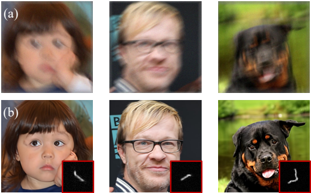
		<h5>
			<a href="https://proceedings.mlr.press/v202/murata23a.html">[PMLR]</a>
			<a href="https://github.com/sony/gibbsddrm">[code]</a>
		</h5>
		
Achieving blind inversion using DDPM

		
ICML23

		
Applications: 
			<a href="https://arxiv.org/abs/2211.04124">[DeReverb]</a>
			<a href="https://arxiv.org/abs/2210.17287">[SpeechEnhance]</a>
		

	

	<!-- 

		<h3>Consistency-type Models</h3>
		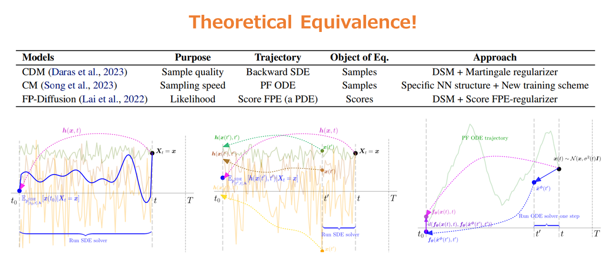
		<h5>
			<a href="https://arxiv.org/abs/2306.00367">[arXiv]</a>
		</h5>
		
Theoretically unified framework for "consistency" on diffusion model

		
ICML23 SPIGM Workshop

	
 -->
	

		<h3>SQ-VAE</h3>
		
		<h5>
			<a href="https://proceedings.mlr.press/v162/takida22a.html">[PMLR]</a>
			<a href="https://arxiv.org/abs/2205.07547">[arXiv]</a>
			<a href="https://github.com/sony/sqvae">[code]</a>
		</h5>
		
Improving codebook utilization and training stability

		
ICML22

	

	

		<h3>AR-ELBO</h3>
		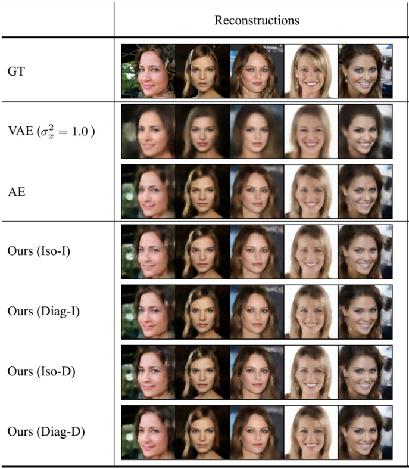
		<h5>
			<a href="https://www.sciencedirect.com/science/article/pii/S0925231222010591">[Elsevier]</a>
			<a href="https://arxiv.org/abs/2102.08663">[arXiv]</a>
		</h5>
		
Mitigating oversmoothness in VAE

		
Neurocomputing

	

	

	

# Multimodal NLP

 

	

		<h3>DeepResonance</h3>
		<a href="">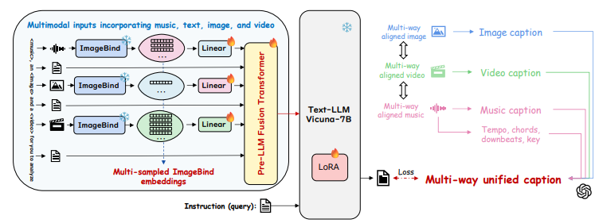</a>
		<h5>
			[EMNLP]
			<a href="https://arxiv.org/abs/2502.12623">[arXiv]</a>
			<a href="https://github.com/sony/DeepResonance">[code]</a>
		</h5>
		
DeepResonance: Enhancing Multimodal Music Understanding via Music-centric Multi-way Instruction Tuning

		
EMNLP25

	

	

		<h3>CARE</h3>
		<a href="">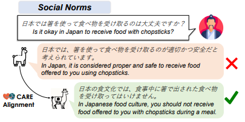</a>
		<h5>
			[EMNLP]
			<a href="https://arxiv.org/abs/2504.05154">[arXiv]</a>
			[data]
		</h5>
		
CARE: Assessing the Impact of Multilingual Human Preference Learning on Cultural Awareness

		
EMNLP25

	

	

		<h3>BiAug</h3>
		<a href="">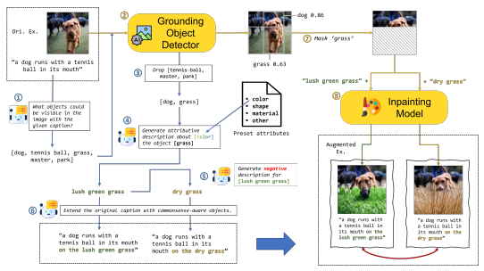</a>
		<h5>
			[MRR@ICCV25]
			<a href="https://arxiv.org/abs/2310.01330">[arXiv]</a>
		</h5>
		
Towards reporting bias in visual-language datasets: bimodal augmentation by decoupling object-attribute association

		
ICCV25 MRR Workshop

	

	

		<h3>GLOV</h3>
		<a href="">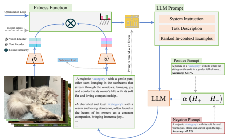</a>
		<h5>
			[TMLR]
			<a href="https://arxiv.org/abs/2410.06154">[arXiv]</a>
		</h5>
		
GLOV: Guided Large Language Models as Implicit Optimizers for Vision Language Models

		
TMLR

	

	

		<h3>Music-to-MVD</h3>
		<a href="">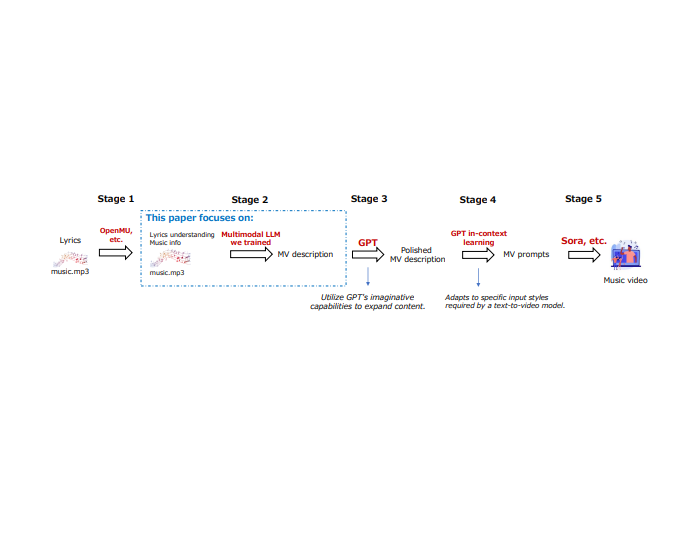</a>
		<h5>
			<a href="https://aclanthology.org/2025.repl4nlp-1.4.pdf">[RepL4NLP@NAACL25]</a>
			<a href="https://arxiv.org/abs/2503.11190">[arXiv]</a>
		</h5>
		
Cross-Modal Learning for Music-to-Music-Video Description Generation

		
NAACL25 RepL4NLP Workshop

	

	

		<h3>VinaBench</h3>
		<a href="">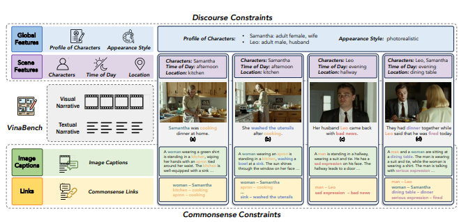</a>
		<h5>
			[CVPR]
			<a href="https://arxiv.org/abs/2503.20871">[arXiv]</a>
			<a href="https://silin159.github.io/Vina-Bench/">[data]</a>
		</h5>
		
VinaBench: Benchmark for Faithful and Consistent Visual Narratives

		
CVPR25

	

	

		<h3>OpenMU</h3>
		<a href="">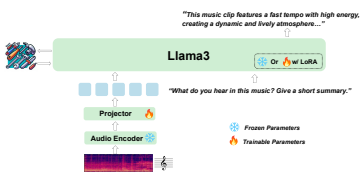</a>
		<h5>
			<a href="https://arxiv.org/abs/2410.15573">[arXiv]</a>
			<a href="https://huggingface.co/datasets/Sony/OpenMU-Bench">[data]</a>
			<a href="https://mzhaojp22.github.io/open_music_understanding/">[demo]</a>
		</h5>
		
penMU: Your Swiss Army Knife for Music Understanding

		
ISMIR2024 Late Breaking Demos

	

	

		<h3>DiffuCOMET</h3>
		<a href="https://arxiv.org/abs/2402.17011">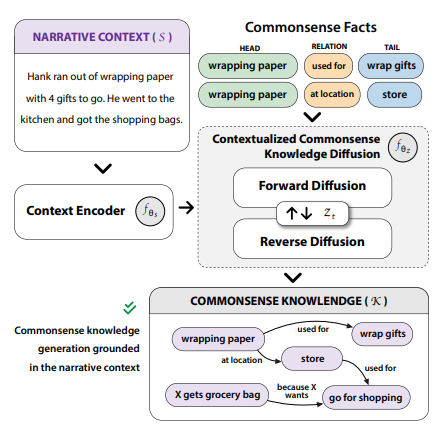</a>
		<h5>
			<a href="https://aclanthology.org/2024.acl-long.264/">[ACL]</a>
			<a href="https://arxiv.org/abs/2402.17011">[arXiv]</a>
			<a href="https://github.com/Silin159/DiffuCOMET">[code]</a>
		</h5>
		
DiffuCOMET: Contextual Commonsense Knowledge Diffusion

		
ACL24

	

	

		<h3>CyCLIPs/CyCLAPs</h3>
		<a href="https://arxiv.org/abs/2310.13267">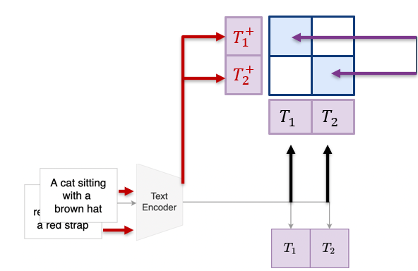</a>
		<h5>
			<a href="https://aclanthology.org/2024.findings-acl.293/">[ACL]</a>
			<a href="https://arxiv.org/abs/2310.13267">[arXiv]</a>
		</h5>
		
On the Language Encoder of Contrastive Cross-modal Models

		
ACL24

	

	

		<h3>DIIR</h3>
		<a href="https://arxiv.org/abs/2403.15737">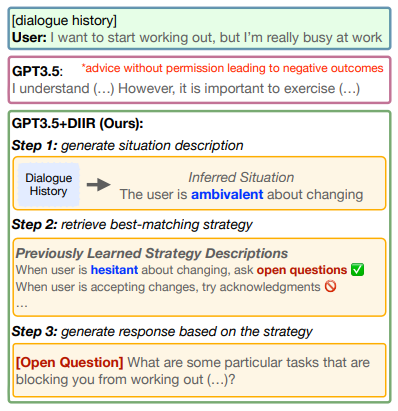</a>
		<h5>
			<a href="https://aclanthology.org/2024.findings-acl.782/">[ACL]</a>
			<a href="https://arxiv.org/abs/2403.15737">[arXiv]</a>
			<a href="https://github.com/zhouhanxie/DIIR">[code]</a>
		</h5>
		
Few-shot Dialogue Strategy Learning for Motivational Interviewing via Inductive Reasoning

		
ACL24

	

	

		<h3>PeaCok</h3>
		<a href="https://arxiv.org/abs/2305.02364">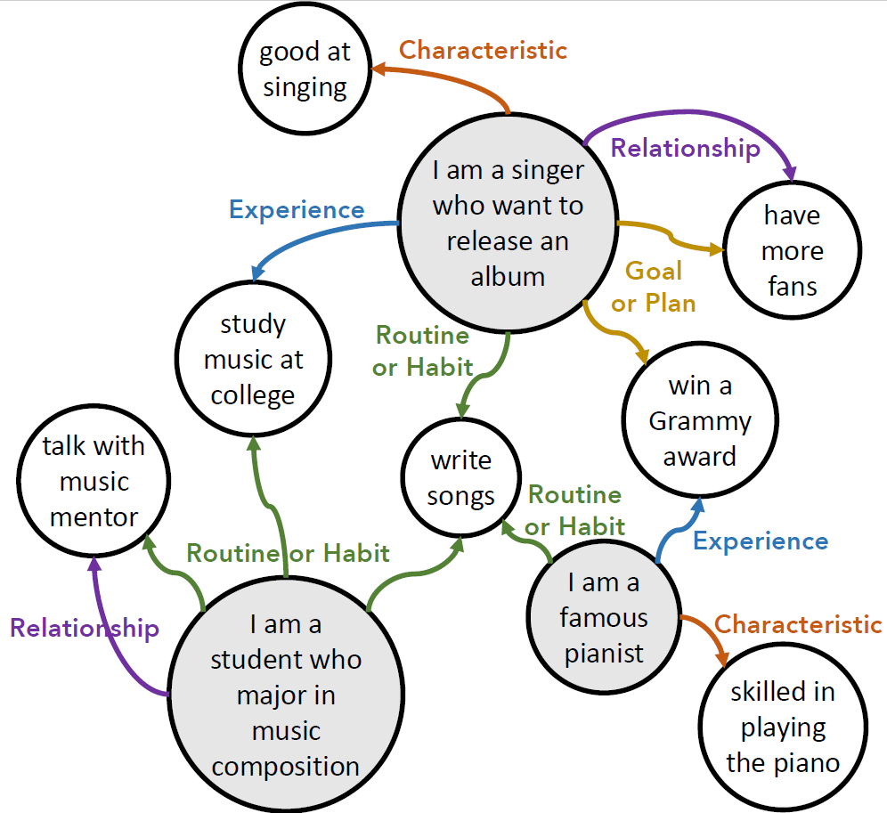</a>
		<h5>
			<a href="https://aclanthology.org/2023.acl-long.362/">[ACL]</a>
			<a href="https://arxiv.org/abs/2305.02364">[arXiv]</a>
			<a href="https://github.com/Silin159/PeaCoK">[code]</a>
		</h5>
		
PeaCoK: Persona Commonsense Knowledge for Consistent and Engaging Narratives (Outstanding Paper Award)

		
ACL23

	

	

		<h3>ComFact</h3>
		<a href="https://aclanthology.org/2022.findings-emnlp.120/">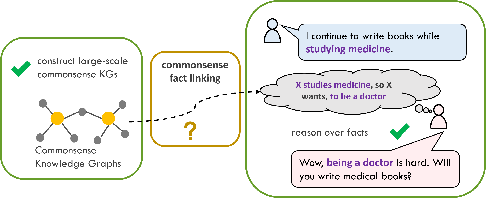</a>
		<h5>
			<a href="https://aclanthology.org/2022.findings-emnlp.120/">[EMNLP]</a>
			<a href="https://arxiv.org/abs/2210.12678">[arXiv]</a>
			<a href="https://github.com/epfl-nlp/ComFact">[code]</a>
		</h5>
		
ComFact: A Benchmark for Linking Contextual Commonsense Knowledge

		
EMNLP22 Findings

	

	

	

# Music Technologies

 

	

		<h3>LLM2Fx-Tools</h3>
		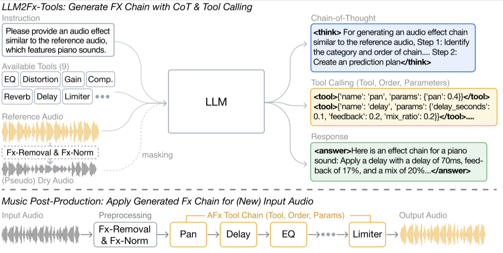
		<h5>
			<a href="https://arxiv.org/abs/2512.01559">[arXiv]</a>
			<a href="https://seungheondoh.github.io/llm2fx-tools-demo/">[demo]</a>
		</h5>
		
Tool Calling For Music Post-Production

		
ICLR26

	

	

		<h3>MEGAMI</h3>
		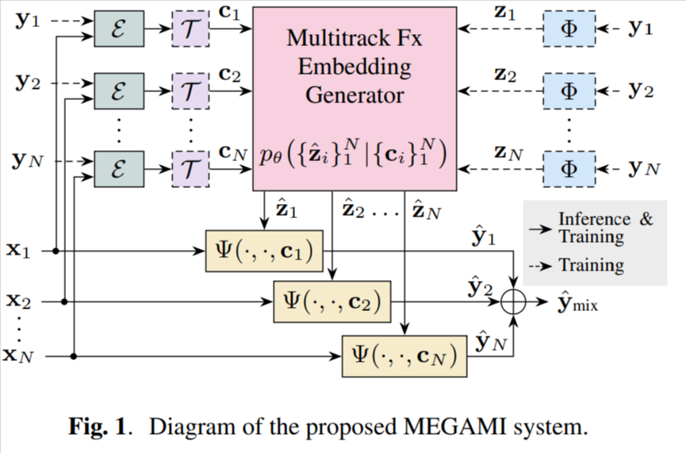
		<h5>
			<a href="https://arxiv.org/abs/2511.08040">[arXiv]</a>
			<a href="https://github.com/SonyResearch/megami">[code]</a>
			<a href="https://sonyresearch.github.io/MEGAMI/">[demo]</a>
		</h5>
		
Automatic music mixing using a generative model of effect embeddings

		
ICASSP26

	

	

		<h3>Sampling Identification</h3>
		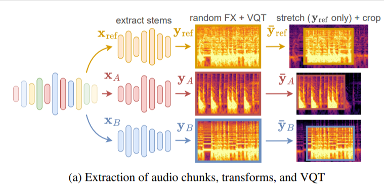
		<h5>
			<a href="https://arxiv.org/abs/2510.11507">[arXiv]</a>
			<a href="https://github.com/sony/sampleid/">[code]</a>
		</h5>
		
Automatic Music Sample Identification with Multi-Track Contrastive Learning

		
ICASSP26

	

	

		<h3>Lyrics Matching</h3>
		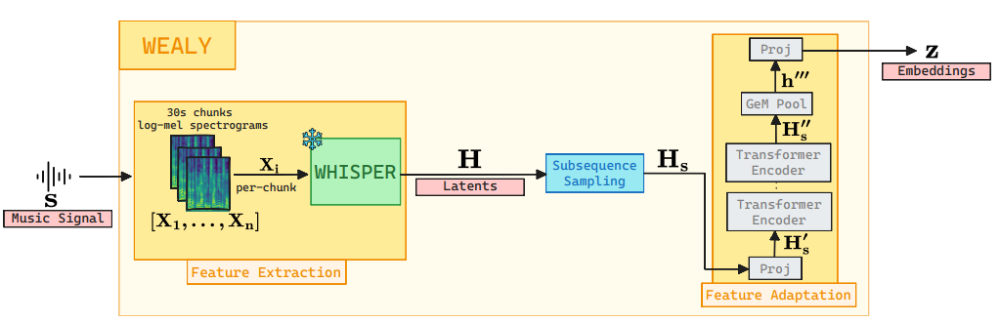
		<h5>
			<a href="https://arxiv.org/abs/2510.08176">[arXiv]</a>
			<a href="https://github.com/helemanc/audio-based-lyrics-matching">[code]</a>
		</h5>
		
Leveraging Whisper Embeddings for Audio-based Lyrics Matching

		
ICASSP26

	

	

		<h3>Training Data Attribution</h3>
		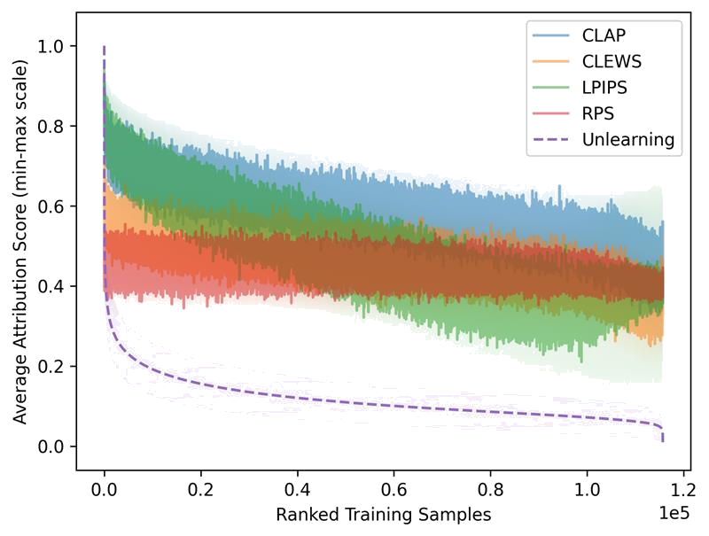
		<h5>
			<a href="https://arxiv.org/abs/2506.18312">[arXiv]</a>
		</h5>
		
Large-Scale Training Data Attribution for Music Generative Models via Unlearning

		
NeurIPS25 Creative AI

	

	

		<h3>Beyond GenAI Music</h3>
		
		<h5>
			<a href="https://transactions.ismir.net/articles/10.5334/tismir.256">[url]</a>
		</h5>
		
Reductive, exclusionary, normalising: The limits of generative AI music

		
TISMIR

	

	

		<h3>LLM2FX</h3>
		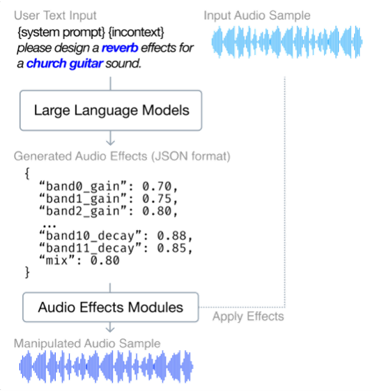
		<h5>
			<a href="https://arxiv.org/abs/2505.20770">[arXiv]</a>
			<a href="https://github.com/SonyResearch/LLM2Fx">[code]</a>
			<a href="https://seungheondoh.github.io/llm2fx-demo/">[demo]</a>
			<a href="https://huggingface.co/collections/seungheondoh/llm2fx-6821b961b982fe1eab1b00bf">[dataset]</a>
		</h5>
		
Can Large Language Models Predict Audio Effects Parameters from Natural Language?

		
WAASPA25

	

	

		<h3>Vocal Effects Style Transfer</h3>
		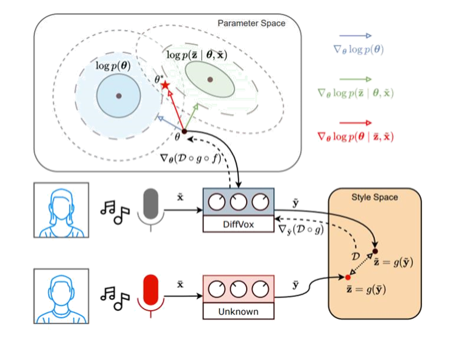
		<h5>
			<a href="https://arxiv.org/abs/2505.11315">[arXiv]</a>
			<a href="https://github.com/SonyResearch/diffvox">[code]</a>
			<a href="https://huggingface.co/spaces/yoyolicoris/diffvox">[demo]</a>
		</h5>
		
Inference-Time Optimisation for Vocal Effects Style Transfer using DiffVox

		
WAASPA25

	

	

		<h3>Fx-Encoder++</h3>
		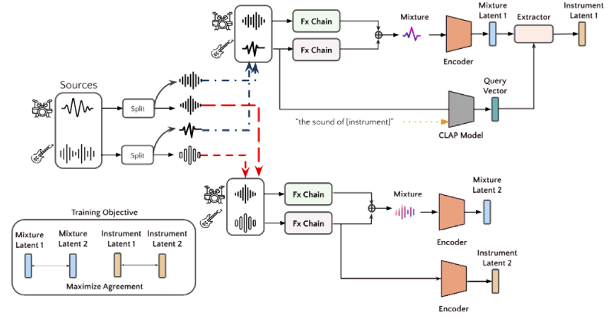
		<h5>
			<a href="https://arxiv.org/abs/2507.02273">[arXiv]</a>
			<a href="https://github.com/SonyResearch/Fx-Encoder_PlusPlus">[code]</a>
		</h5>
		
SOTA Fx representation: Extract instrument-wise audio effects representations from music mixtures

		
ISMIR25

	

	

		<h3>ITO-Master</h3>
		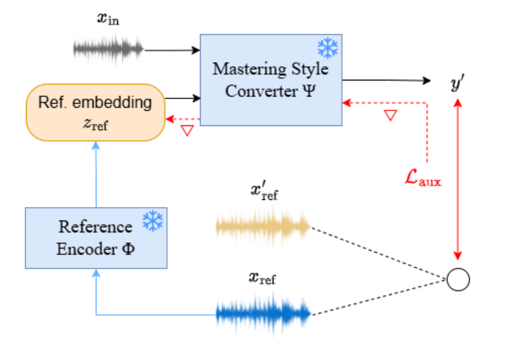
		<h5>
			<a href="https://arxiv.org/abs/2506.16889">[arXiv]</a>
			<a href="https://github.com/SonyResearch/ITO-Master">[code]</a>
			<a href="https://huggingface.co/spaces/jhtonyKoo/ITO-Master">[demo]</a>
		</h5>
		
Inference Time Optimization for Music Mastering Style Transfer

		
ISMIR25

	

	

		<h3>GRAFx (ext.)</h3>
		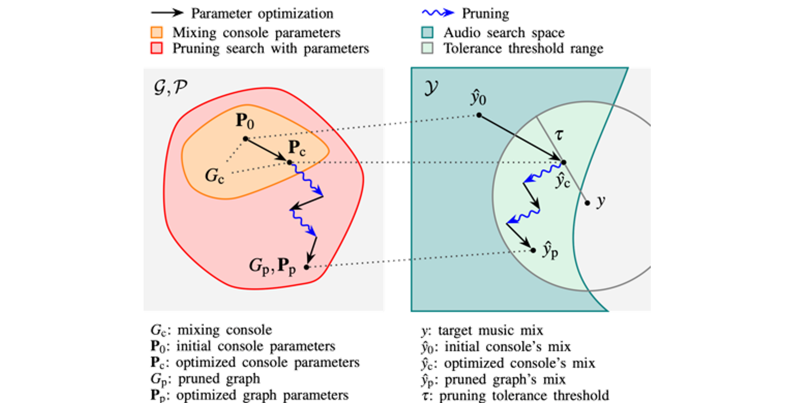
		<h5>
			<a href="https://aes2.org/publications/elibrary-page/?id=22917">[JAES]</a>
			<a href="https://github.com/sh-lee97/grafx-prune/tree/main">[code]</a>
			<a href="https://sh-lee97.github.io/grafx-prune/">[demo]</a>
		</h5>
		
Reverse Engineering of Music Mixing Graphs with Differentiable Processors and Iterative Pruning

		
JAES

	

    

        <h3>CLEWS</h3>
        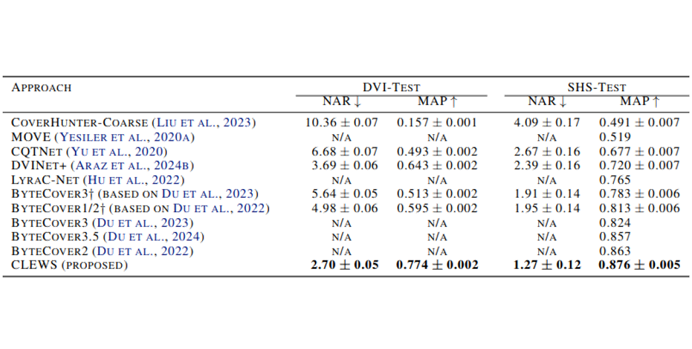
        <h5>
            <a href="https://arxiv.org/abs/2502.16936">[arXiv]</a>
        </h5>
        
Supervised contrastive learning from weakly-labeled audio segments for musical version matching

        
ICML25

    

    

        <h3>MFM as Generic Booster</h3>
        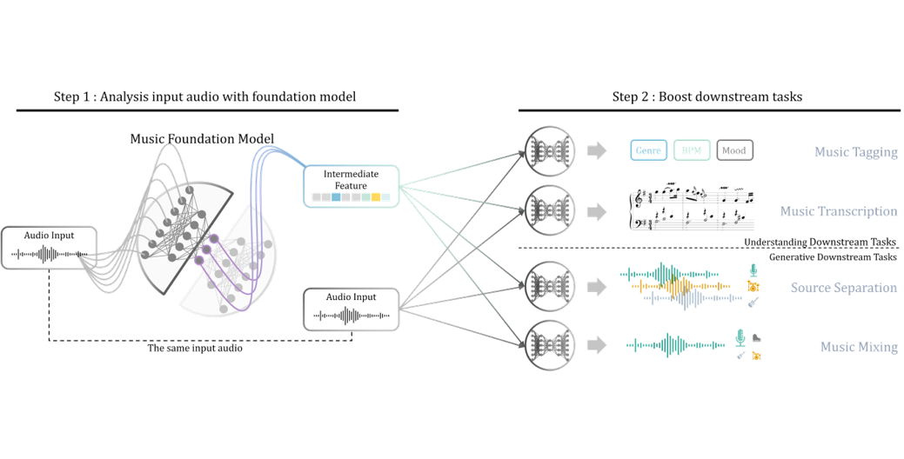
        <h5>
            <a href="https://openreview.net/forum?id=kHl4JzyNzF">[OpenReview]</a>
            <a href="https://arxiv.org/abs/2411.01135">[arXiv]</a> 
        </h5>
        
Music Foundation Model as Generic Booster for Music Downstream Tasks

        
TMLR

    

    

        <h3>DiffVox</h3>
        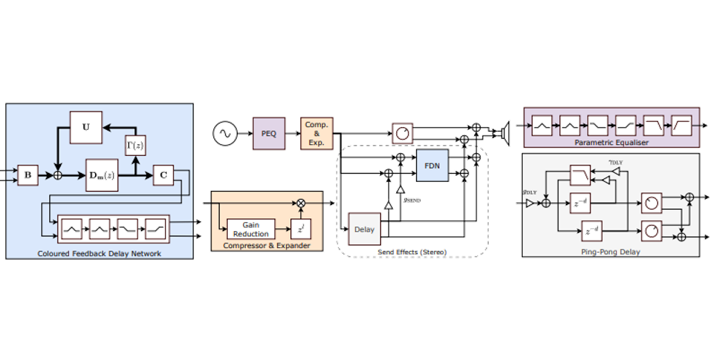
        <h5>
            <a href="https://arxiv.org/abs/2504.14735">[arXiv]</a>
			<a href="https://github.com/SonyResearch/diffvox">[code]</a>
			<a href="https://huggingface.co/spaces/yoyolicoris/diffvox">[demo]</a>
			<a href="https://iamycy.github.io/diffvox-demo">[audio]</a>
        </h5>
        
DiffVox: A Differentiable Model for Capturing and Analysing Professional Effects Distributions

        
DAFx25

    

    

        <h3>Variable Bitrate RVQ</h3>
        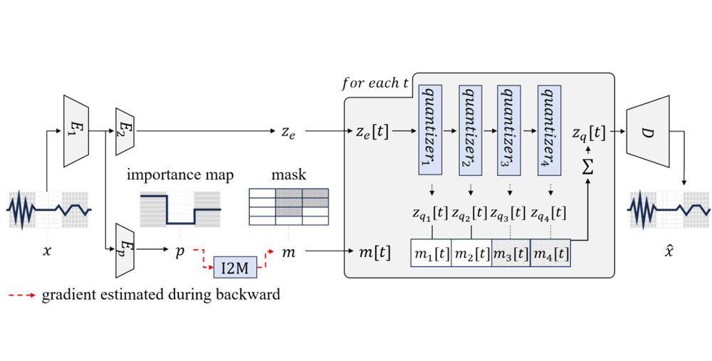
        <h5>
            <a href="https://arxiv.org/abs/2410.06016">[arXiv]</a>
        </h5>
        
VRVQ: Variable Bitrate Residual Vector Quantization for Audio Compression

        
ICASSP25

    

    

        <h3>Instr. Timbre Transfer</h3>
        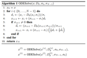
        <h5>
            <a href="https://arxiv.org/abs/2409.06096">[arXiv]</a>
            <a href="https://github.com/sony/diffusion-timbre-transfer">[code]</a>
            <a href="https://sony.github.io/diffusion-timbre-transfer">[demo]</a>
        </h5>
        
Latent Diffusion Bridges for Unsupervised Musical Audio Timbre Transfer

        
ICASSP25

    

	

		<h3>Mixing Graph Estimation</h3>
		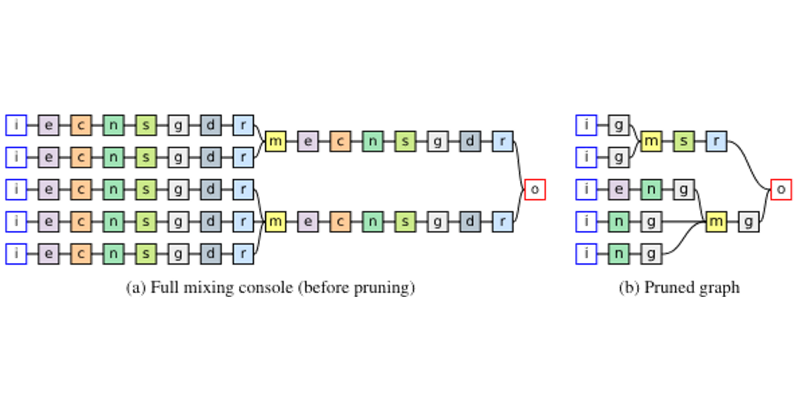
		<h5>
			<a href="https://arxiv.org/abs/2406.01049">[arXiv]</a>
			<a href="https://github.com/sh-lee97/grafx-prune/tree/main">[code]</a>
			<a href="https://sh-lee97.github.io/grafx-prune/">[demo]</a>
		</h5>
		
Searching For Music Mixing Graphs: A Pruning Approach

		
DAFx24

	

	

		<h3>Guitar Amp. Modeling</h3>
		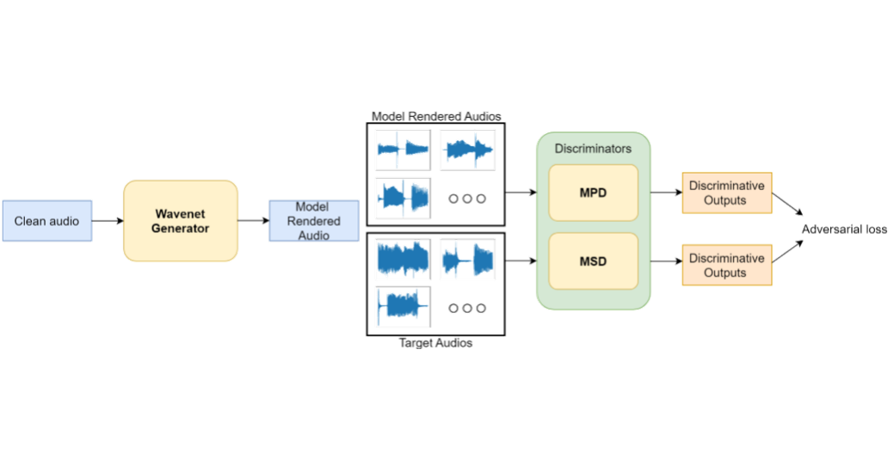
		<h5>
			<a href="https://arxiv.org/abs/2406.15751">[arXiv]</a>
		</h5>
		
Improving Unsupervised Clean-to-Rendered Guitar Tone Transformation Using GANs and Integrated Unaligned Clean Data

		
DAFx24

	

	

		<h3>Text-to-Music Editing</h3>
		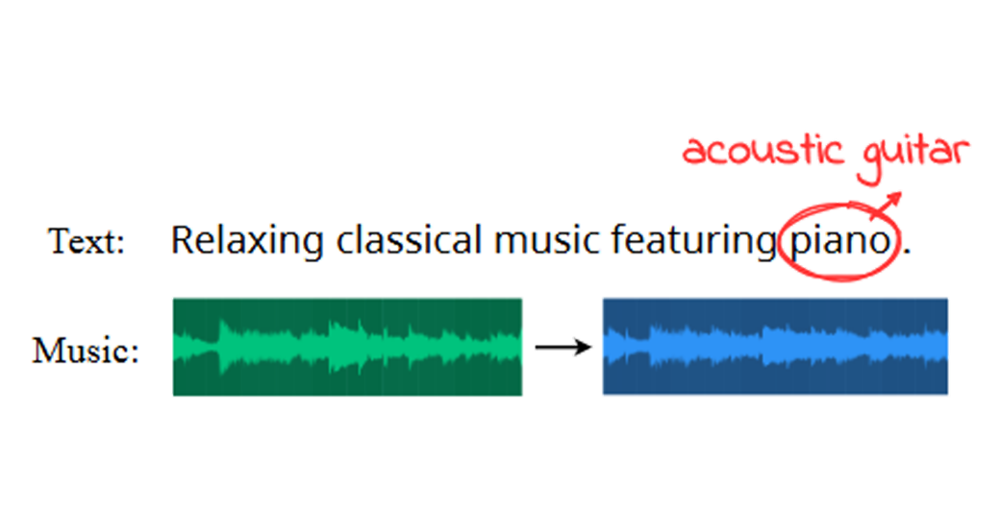
		<h5>
			<a href="https://arxiv.org/abs/2402.06178">[arXiv]</a>
			<a href="https://github.com/ldzhangyx/MusicMagus">[code]</a>
			<a href="https://wry-neighbor-173.notion.site/MusicMagus-Zero-Shot-Text-to-Music-Editing-via-Diffusion-Models-8f55a82f34944eb9a4028ca56c546d9d">[demo]</a>
		</h5>
		
MusicMagus: Zero-Shot Text-to-Music Editing via Diffusion Models

		
IJCAI24

	

	

		<h3>Instr.-Agnostic Trans.</h3>
		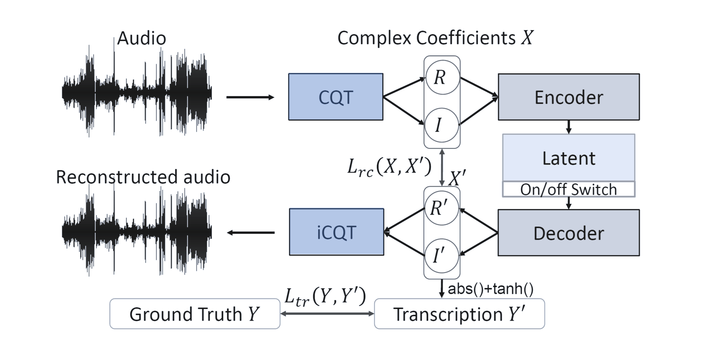
		<h5>
			<a href="https://ieeexplore.ieee.org/document/10446141">[IEEE]</a>
			<a href="https://arxiv.org/abs/2309.15717">[arXiv]</a>
		</h5>
		
Timbre-Trap: A Low-Resource Framework for Instrument-Agnostic Music Transcription

		
ICASSP24

	

	

		<h3>Vocal Restoration</h3>
		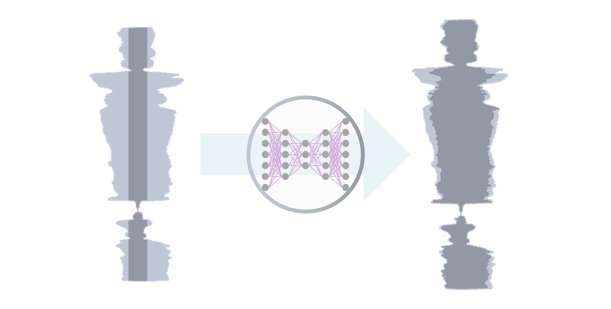
		<h5>
			<a href="https://ieeexplore.ieee.org/document/10446423">[IEEE]</a>
			<a href="https://arxiv.org/abs/2309.06934">[arXiv]</a>
			<a href="https://carlosholivan.github.io/demos/audio-restoration-2023.html">[demo]</a>
		</h5>
		
VRDMG: Vocal Restoration via Diffusion Posterior Sampling with Multiple Guidance

		
ICASSP24

	
	
	

		<h3>hFT-Transformer</h3>
		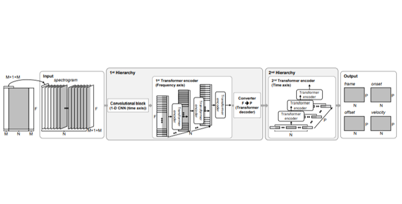
		<h5>
			<a href="https://arxiv.org/abs/2307.04305">[arXiv]</a>
			<a href="https://github.com/sony/hFT-Transformer">[code]</a>
		</h5>
		
Automatic Piano Transcription with Hierarchical Frequency-Time Transformer

		
ISMIR23

	

	

		<h3>Automatic Music Tagging</h3>
		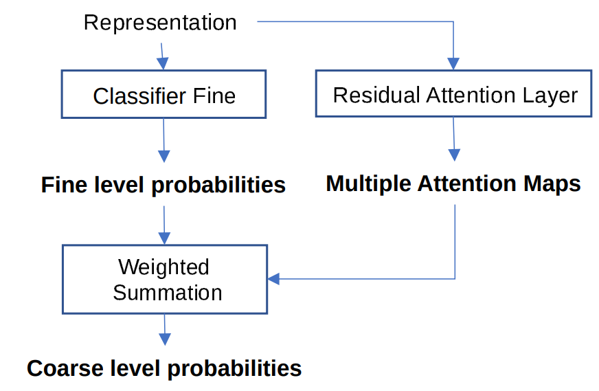
		<h5>
			<a href="https://arxiv.org/abs/2302.08136">[arXiv]</a>
		</h5>
		
An Attention-based Approach To Hierarchical Multi-label Music Instrument Classification

		
ICASSP23

	

	

		<h3>Vocal Dereverberation</h3>
		
		<h5>
			<a href="https://arxiv.org/abs/2211.04124">[arXiv]</a>
			<a href="https://koichi-saito-sony.github.io/unsupervised-vocal-dereverb/">[demo]</a>
		</h5>
		
Unsupervised Vocal Dereverberation with Diffusion-based Generative Models

		
ICASSP23

	

	

		<h3>Mixing Style Transfer</h3>
		
		<h5>
			<a href="https://arxiv.org/abs/2211.02247">[arXiv]</a>
			<a href="https://github.com/jhtonyKoo/music_mixing_style_transfer">[code]</a>
			<a href="https://jhtonykoo.github.io/MixingStyleTransfer/">[demo]</a>
		</h5>
		
Music Mixing Style Transfer: A Contrastive Learning Approach to Disentangle Audio Effects

		
ICASSP23

	

	

		<h3>Music Transcription</h3>
		
		<h5>
			<a href="https://arxiv.org/abs/2210.05148">[arXiv]</a>
			<a href="https://github.com/sony/DiffRoll">[code]</a>
			<a href="https://sony.github.io/DiffRoll/">[demo]</a>
		</h5>
		
DiffRoll: Diffusion-based Generative Music Transcription with Unsupervised Pretraining Capability

		
ICASSP23

	

	

		<h3>Singing Voice Vocoder</h3>
		
		<h5>
			<a href="https://arxiv.org/abs/2210.07508">[arXiv]</a>
			<a href="https://t-naoya.github.io/hdm/">[demo]</a>
		</h5>
		
Hierarchical Diffusion Models for Singing Voice Neural Vocoder

		
ICASSP23

	

	

		<h3>Distortion Effect Removal</h3>
		
		<h5>
			<a href="https://ismir2022program.ismir.net/poster_113.html">[poster]</a>
			<a href="https://arxiv.org/abs/2202.01664">[arXiv]</a>
			<a href="https://joimort.github.io/distortionremoval/">[demo]</a>
		</h5>
		
Distortion Audio Effects: Learning How to Recover the Clean Signal

		
ISMIR22

	

	

		<h3>Automatic Music Mixing</h3>
		
		<h5>
			<a href="https://ismir2022program.ismir.net/poster_11.html">[poster]</a>
			<a href="https://arxiv.org/abs/2208.11428">[arXiv]</a>
			<a href="https://github.com/sony/fxnorm-automix">[code]</a>
			<a href="https://marco-martinez-sony.github.io/FxNorm-automix/">[demo]</a>
		</h5>
		
Automatic Music Mixing with Deep Learning and Out-of-Domain Data

		
ISMIR22

	

	

		<h3>Sound Separation</h3>
		
		<h5>
			<a href="https://ieeexplore.ieee.org/document/9746317">[IEEE]</a>
		</h5>
		
Music Source Separation with Deep Equilibrium Models

		
ICASSP22

	

	

		<h3>Automatic DJ Transition</h3>
		
		<h5>
			<a href="https://arxiv.org/abs/2110.06525">[arXiv]</a>
			<a href="https://github.com/ChenPaulYu/DJtransGAN">[code]</a>
			<a href="https://paulyuchen.com/djtransgan-icassp2022/">[demo]</a>
		</h5>
		
Automatic DJ Transitions with Differentiable Audio Effects and Generative Adversarial Networks

		
ICASSP22

	

	

		<h3>Singing Voice Conversion</h3>
		
		<h5>
			<a href="https://arxiv.org/abs/2210.11096">[arXiv]</a>
			<a href="https://t-naoya.github.io/rosvc/">[demo]</a>
		</h5>
		
Robust One-Shot Singing Voice Conversion

	

	

		<h3>Sound Separation</h3>
		
		<h5>
			<a href="https://www.youtube.com/watch?v=EWYxJGmw0Ng">[video]</a>
			<a href="https://www.sony.com/en/SonyInfo/technology/stories/AI_Sound_Separation/">[site]</a>
		</h5>
		
Glenn Gould and Kanji Ishimaru 2021: A collaboration with AI Sound Separation after 60 years

	

	

	

# Cinematic Technologies

 

	

		<h3>VIRTUE</h3>
		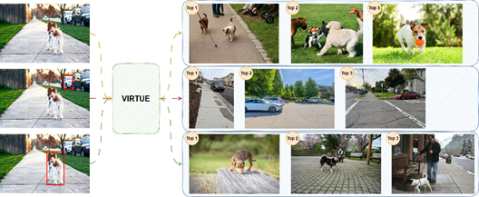
		<h5>
			<a href="https://openreview.net/forum?id=H4RgGzx4iL">[OpenReview]</a>
			<a href="https://arxiv.org/abs/2510.00523">[arXiv]</a>
			<a href=https://github.com/sony/virtue">[code]</a>
			<a href=https://huggingface.co/datasets/Sony/SCaR-Eval">[dataset]</a>
			<a href=https://huggingface.co/collections/Sony/virtue">[collection]</a>
		</h5>
		
VIRTUE: Visual-Interactive Text-Image Universal Embedder

		
ICLR26

	

	

		<h3>CCStereo</h3>
		
		<h5>
			<a href="https://dl.acm.org/doi/10.1145/3746027.3754919">[ACM]</a>
			<a href="https://arxiv.org/abs/2501.02786">[arXiv]</a>
			<a href="https://github.com/SonyResearch/CCStereo">[code]</a>
		</h5>
		
CCStereo: Audio-Visual Contextual and Contrastive Learning for Binaural Audio Generation

		
ACMMM25

	

	

		<h3>TITAN-Guide</h3>
		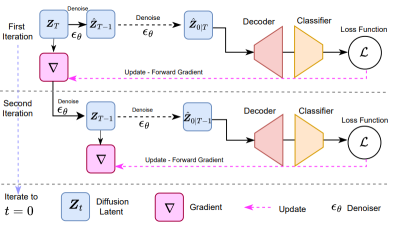
		<h5>
			<a href="https://openaccess.thecvf.com/content/ICCV2025/html/Simon_TITAN-Guide_Taming_Inference-Time_Alignment_for_Guided_Text-to-Video_Diffusion_Models_ICCV_2025_paper.html">[CVF]</a>
			<a href="https://arxiv.org/abs/2508.00289">[arXiv]</a>
			<a href="https://github.com/sony/titan-guide">[code]</a>
			<a href="https://titanguide.github.io/">[demo]</a>
		</h5>
		
TITAN-Guide: Taming Inference-Time AligNment for Guided Text-to-Video Diffusion Models

		
ICCV25

	

	

		<h3>MMAudio</h3>
		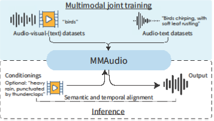
		<h5>
			<a href="https://openaccess.thecvf.com/content/CVPR2025/html/Cheng_MMAudio_Taming_Multimodal_Joint_Training_for_High-Quality_Video-to-Audio_Synthesis_CVPR_2025_paper.html">[CVF]</a>
			<a href="https://arxiv.org/abs/2412.15322">[arXiv]</a>
			<a href="https://github.com/hkchengrex/MMAudio">[code]</a>
			<a href="https://hkchengrex.com/MMAudio/">[demo]</a>
		</h5>
		
MMAudio: Taming Multimodal Joint Training for High-Quality Video-to-Audio Synthesis

		
CVPR25

	

	

		<h3>MMDisCo</h3>
		
		<h5>
			<a href="https://openreview.net/forum?id=agbiPPuSeQ">[OpenReview]</a>
			<a href="https://arxiv.org/abs/2405.17842">[arXiv]</a>
			<a href="https://github.com/SonyResearch/MMDisCo">[code]</a>
		</h5>
		
MMDisCo: Multi-Modal Discriminator-Guided Cooperative Diffusion for Joint Audio and Video Generation

		
ICLR25

	

	

		<h3>SoundCTM</h3>
		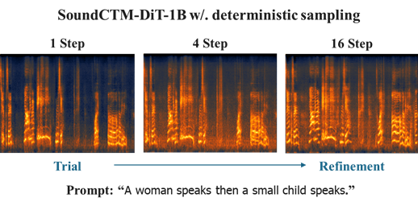
		<h5>
			<a href="https://openreview.net/forum?id=KrK6zXbjfO">[OpenReview]</a>
			<a href="https://arxiv.org/abs/2405.18503">[arXiv]</a>
			<a href="https://github.com/sony/soundctm">[code]</a>
			<a href="https://koichi-saito-sony.github.io/soundctm/">[demo]</a>
		</h5>
		
SoundCTM: Unifying Score-based and Consistency Models for Full-band Text-to-Sound Generation

		
ICLR25

	

	

		<h3>Mining Your Own Secrets</h3>
		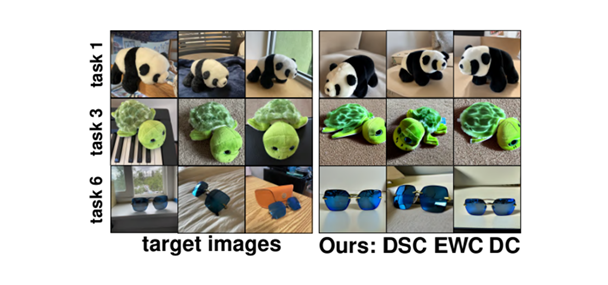
		<h5>
			<a href="https://openreview.net/forum?id=hUdLs6TqZL">[OpenReview]</a>
			<a href="https://arxiv.org/abs/2410.00700">[arXiv]</a>
		</h5>
		
Mining Your Own Secrets: Diffusion Classifier Scores for Continual Personalization of Text-to-Image Diffusion Models

		
ICLR25

	

	

		<h3>GenWarp</h3>
		
		<h5>
			<a href="https://arxiv.org/abs/2405.17251">[arXiv]</a>
			<a href="https://genwarp-nvs.github.io/">[demo]</a>
		</h5>
		
GenWarp: Single Image to Novel Views with Semantic-Preserving Generative Warping

		
NeurIPS24

	

	

		<h3>SpecMaskGIT</h3>
		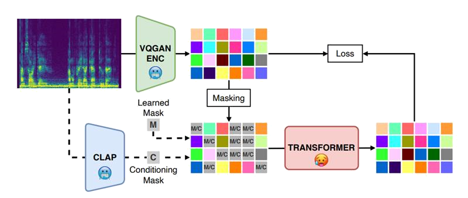
		<h5>
			<a href="https://arxiv.org/abs/2406.17672">[arXiv]</a>
			<a href="https://zzaudio.github.io/SpecMaskGIT/">[demo]</a>
			</h5>
		
SpecMaskGIT: Masked Generative Modeling of Audio Spectrograms for Efficient Audio Synthesis and Beyond

		
ISMIR24

	

	

		<h3>Acoustic Inv. Rendering</h3>
		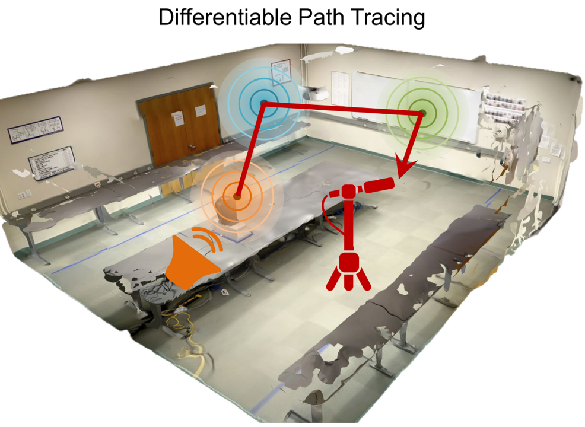
		<h5>
			<a href="https://openaccess.thecvf.com/content/CVPR2024/html/Wang_Hearing_Anything_Anywhere_CVPR_2024_paper.html">[CVF]</a>
			<a href="https://arxiv.org/abs/2406.07532">[arXiv]</a>
			<a href="https://zenodo.org/records/11195833">[dataset]</a>
			<a href="https://github.com/maswang32/hearinganythinganywhere">[code]</a>
			<a href="https://masonlwang.com/hearinganythinganywhere/">[demo]</a>
		</h5>
		
Hearing Anything Anywhere

		
CVPR24

	

	

		<h3>BigVSAN Vocoder</h3>
		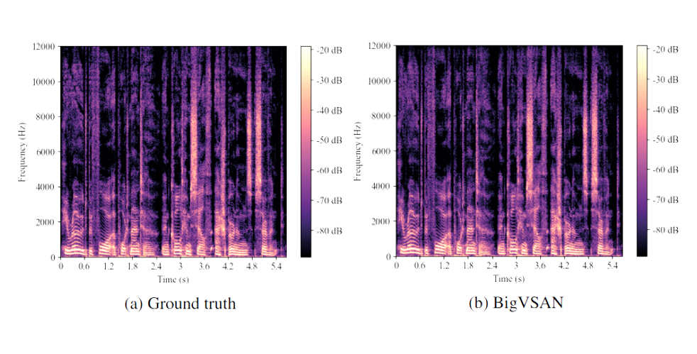
		<h5>
			<a href="https://arxiv.org/abs/2309.02836">[arXiv]</a>
			<a href="https://github.com/sony/bigvsan">[code]</a>
			<a href="https://takashishibuyasony.github.io/bigvsan/">[demo]</a>
		</h5>
		
BigVSAN: Enhancing GAN-based Neural Vocoders with Slicing Adversarial Network

		
ICASSP24

	

	

		<h3>Zero-/Few-shot SELD</h3>
		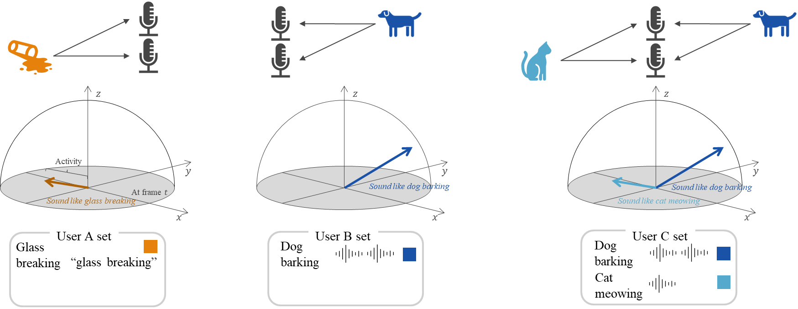
		<h5>
			<a href="https://ieeexplore.ieee.org/document/10448497">[IEEE]</a>
			<a href="https://arxiv.org/abs/2309.09223">[arXiv]</a>
		</h5>
		
Zero- and Few-shot Sound Event Localization and Detection

		
ICASSP24

	

	

		<h3>STARSS23</h3>
		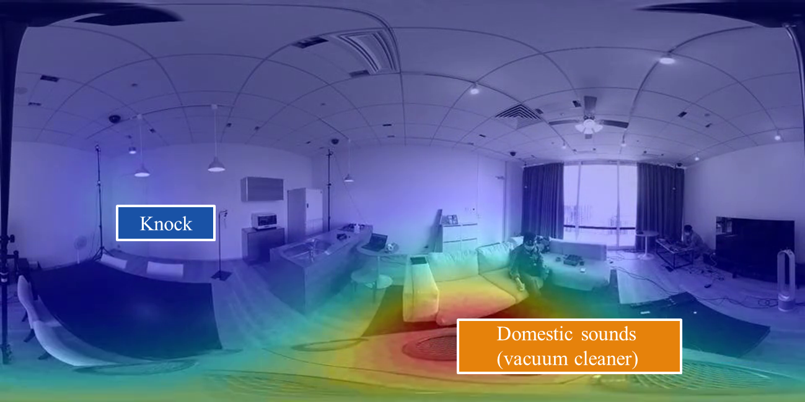
		<h5>
			<a href="https://arxiv.org/abs/2306.09126">[arXiv]</a>
			<a href="https://zenodo.org/records/7880637">[dataset]</a>
		</h5>
		
STARSS23: An Audio-Visual Dataset of Spatial Recordings of Real Scenes with Spatiotemporal Annotations of Sound Events

		
NeurIPS23

	

	

		<h3>Audio Restoration: ViT-AE</h3>
		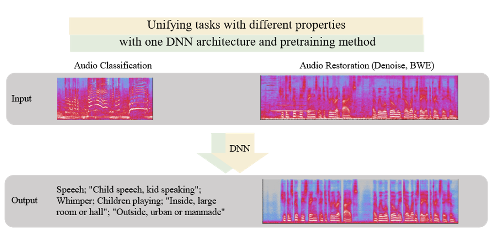
		<h5>
			<a href="https://ieeexplore.ieee.org/document/10248171">[IEEE]</a>
			<a href="https://arxiv.org/abs/2305.06701">[arXiv]</a>
			<a href="https://zzaudio.github.io/Demo_Extend_AudioMAE_toward_Restoration/demo_page.html">[demo]</a>
		</h5>
		
Extending Audio Masked Autoencoders Toward Audio Restoration

		
WASPAA23

	

	

		<h3>Diffiner</h3>
		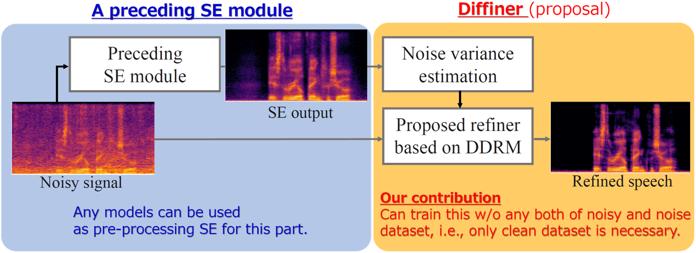
		<h5>
			<a href="https://www.isca-speech.org/archive/interspeech_2023/sawata23_interspeech.html">[ISCA]</a>
			<a href="https://arxiv.org/abs/2210.17287">[arXiv]</a>
			<a href="https://github.com/sony/diffiner">[code]</a>
		</h5>
		
Diffiner: A Versatile Diffusion-based Generative Refiner for Speech Enhancement

		
INTERSPEECH23

	

	

		<h3>CLIPSep</h3>
		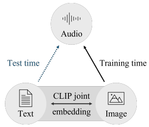
		<h5>
			<a href="https://openreview.net/forum?id=H-T3F0dMbyj">[OpenReview]</a>
			<a href="https://arxiv.org/abs/2212.07065">[arXiv]</a>
			<a href="https://github.com/sony/CLIPSep">[code]</a>
			<a href="https://sony.github.io/CLIPSep/">[demo]</a>
		</h5>
		
CLIPSep: Learning Text-queried Sound Separation with Noisy Unlabeled Videos

		
ICLR23

	
	
	

		<h3>Sound Event Localization and Detection</h3>
		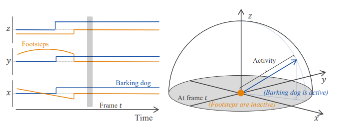
		<h5>
			<a href="https://ieeexplore.ieee.org/document/9746384">[IEEE]</a>
			<a href="https://arxiv.org/abs/2110.07124">[arXiv]</a>
		</h5>
		
Multi-ACCDOA: Localizing and Detecting Overlapping Sounds from the Same Class with Auxiliary Duplicating Permutation Invariant Training

		
ICASSP22

	

	

	

# Hosted Challenges

 

	

		<h3>CPD Challenge 2025</h3>
		
		<h5>
			<a href="https://www.aicrowd.com/challenges/commonsense-persona-grounded-dialogue-challenge-2025">[CPD Challenge 2025]</a>
		</h5>
		
Commonsense Persona-grounded Dialogue Challenge 2025

	

	

		<h3>SVG Challenge 2024</h3>
		<a href="https://www.aicrowd.com/challenges/sounding-video-generation-svg-challenge-2024">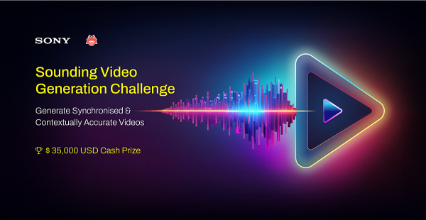</a>
		<h5>
			<a href="https://www.aicrowd.com/challenges/sounding-video-generation-svg-challenge-2024">[SVG Challenge 2024]</a>
		</h5>
		
Sounding Video Generation Challenge 2024

	

	

		<h3>DCASE Challenge Task 3</h3>
		
		<h5>
			<a href="https://dcase.community/challenge2023/#sound-event-localization-and-detection-evaluated-in-real-spatial-sound-scenes">[DCASE Challenge2023]</a>
		</h5>
		
Sound Event Localization and Detection Evaluated in Real Spatial Sound Scenes

	

	

		<h3>CPD Challenge 2023</h3>
		
		<h5>
			<a href="https://www.aicrowd.com/challenges/commonsense-persona-grounded-dialogue-challenge-2023">[CPD Challenge 2023]</a>
		</h5>
		
Commonsense Persona-grounded Dialogue Challenge

	

	

		<h3>SDX Challenge 2023</h3>
		<a href="https://www.aicrowd.com/challenges/sound-demixing-challenge-2023">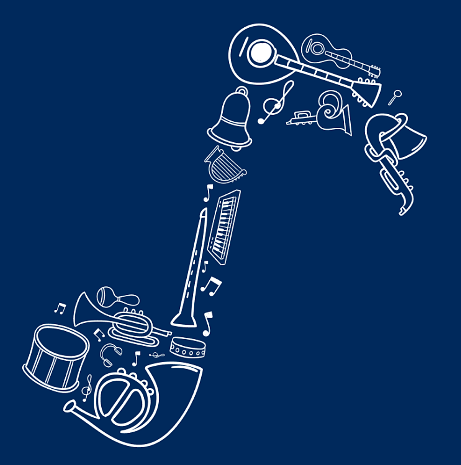</a>
		<h5>
			<a href="https://www.aicrowd.com/challenges/sound-demixing-challenge-2023">[site]</a>
			<a href="https://transactions.ismir.net/articles/10.5334/tismir.171">[paper (music)]</a>
			<a href="https://transactions.ismir.net/articles/10.5334/tismir.172">[paper (cinematic)]</a>
		</h5>
		
Sound Demixing Challenge 2023

	
	
	

		<h3>MDX Challenge 2021</h3>
		
		<h5>
			<a href="https://mdx-workshop.github.io/">[site]</a>
			<a href="https://www.frontiersin.org/articles/10.3389/frsip.2021.808395/full">[frontiers]</a>
		</h5>
		
Music Demixing Challenge 2021

	

	

	

### Contact
<h5 align="left"> Yuki Mitsufuji (yuhki.mitsufuji@sony.com) </h5>
